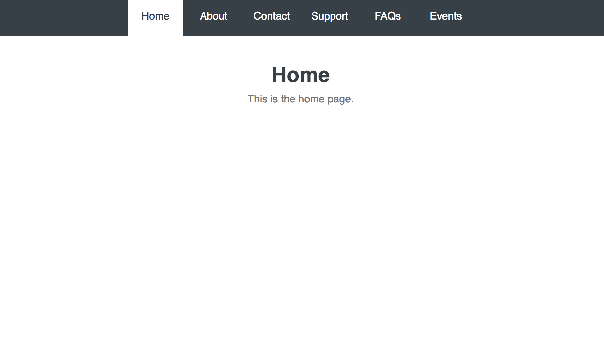

# CREATING A MOBILE DROP DOWN MENU WITH JQUERY
Turning a traditional menu in to a mobile friendly one by creating a simple drop down menu with jQuery.

Technologies Used:
- HTML
- CSS
- JavaScript
- jQuery

## Mobile View

## Desktop View

## Future Features
- Create content on every page
- Style every page

---------
*This application was built while taking the 'jQuery Basics' lesson at Treehouse. February, 2017.
